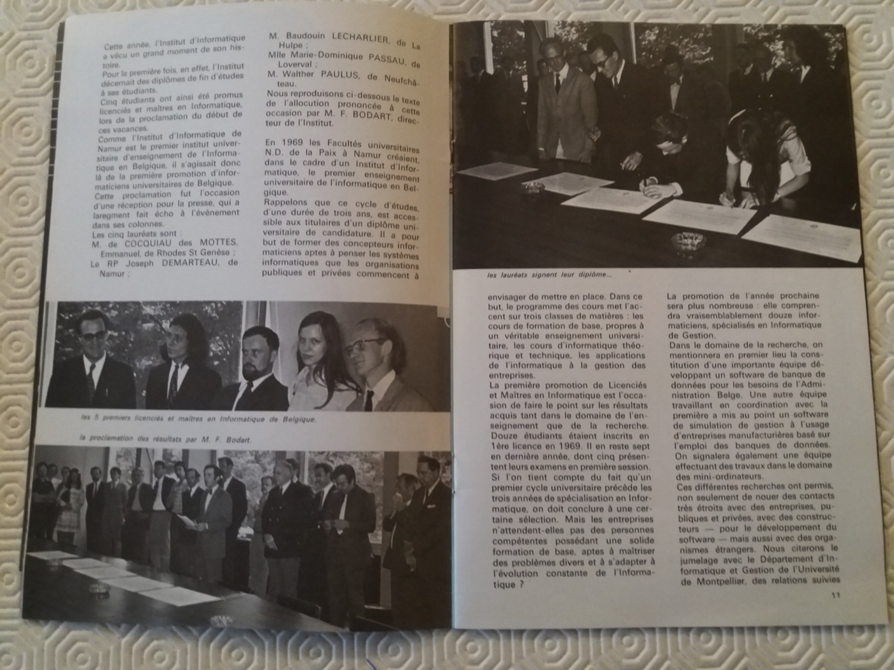

## Quel était le nom et prénom du doyen durant vos études ?

François Bodart était le Directeur de l’Institut d’Informatique. Il n’y avait pas encore de Faculté, donc pas de doyen!

## Quel genre d’étudiante étiez-vous ?

Timide mais très passionnée.

## Quel est votre plus beau souvenir de vos études ?

Il régnait une ambiance très « grande famille » dans tout le département. Nous étions les premiers informaticiens, des cobayes en quelque sorte, et nous voulions tous, professeurs, assistants, secrétaire et étudiants, réussir dans cette nouvelle entreprise.

## Quel est votre plus mauvais souvenir de vos études ?

Ce fut plutôt stressant de découvrir, lors de la défense de mon mémoire, que le livre, recommandé par mon directeur de mémoire et sur lequel se basait un de ses chapitres le plus importants, contenait des erreurs et que personne n’avait jugé bon de m’en avertir. J’ai dû corriger le tout au tableau, à l’improviste (avec succès).

## Souhaitez-vous partager une ou plusieurs autres anecdotes sur vos études ?

Je me souviens avec plaisir d’avoir fait pendant quelque temps de la musique de chambre avec le professeur Bodart et un autre professeur.
Nous avons été en visite à Munich, invités par la firme Siemens, et on m’a remis des fleurs lors de la visite de la station de Raisting. Apparemment, j’étais la 250000ième visiteuse!

## Si vous deviez recontacter un professeur aujourd’hui, lequel serait-ce ?

J’aimerais bien recontacter les professeurs Cherton et Cardinal, car la théorie des langages et compilation doivent avoir tellement changés en 45 / 50 ans. Je garde aussi de très bons souvenirs du professeur Mersch (Métamathématique).

## Une fois vos études terminées, quel a été votre parcours ?

Après mes études, je suis devenue assistante du professeur Elie Milgrom à l’UCL à Louvain-la-Neuve. Il venait de démarrer une option informatique à la faculté des ingénieurs. J’y suis restée 6 ans, durant lesquels j’ai eu 2 enfants. Je me suis rapidement rendue compte que la recherche ne me convenait pas. Je préférais bien mieux me consacrer à l’enseignement et au support des étudiants. Je n’ai donc pas terminé mon doctorat.
J’ai ensuite travaillé pendant deux ans chez Siemens Software où j’ai retrouvé un autre étudiant de mon année : Emmanuel de Cocqueau de Mottes.
J’ai quitté la Belgique pour l’Angleterre en décembre 1981 car mon mari fut transféré à Londres. Avec trois enfants qui avaient besoin de moi pour s’intégrer à l’école, apprendre l’anglais etc... je n’ai pas repris d’emploi immédiatement. Comme tout avait tellement changé en informatique après quelques années, la décision a été prise pour moi.

## Des anecdotes à partager sur votre parcours ?

Vu mon expérience à l’UCL et chez Siemens Software, je n’ai pas pu m’empêcher de constater que l’esprit ouvert et à la pointe rencontré à l’Institut d’informatique ne se retrouvait pas partout... La misogynie en milieu ingénieur était encore rampante à l’époque. Nous avons cependant, Emmanuel et moi-même, réussit à obtenir égalité de salaire avec les ingénieurs chez Siemens après quelques mois.
Une anecdote amusante : à L’UCL, on m’a demandé de fournir les explications d’un modèle de tricot comme exemple d’algorithme non-numérique.

## Des conseils pour les étudiants qui réalisent leur parcours universitaire ou qui vont sortir des études ?

Faire ce que l’on aime! Mon plus grand regret est de n’avoir pas pu enseigner : il n’y avait pas d’agrégation en informatique et on m’a interdit de suivre le cours d’agrégation en maths, parce que j’aurais pu « voler » la place d’un mathématicien. (J’ai un diplôme de candidature en maths).

## Vous vivez maintenant en Angleterre. Est-ce que vous avez des anecdotes ou des comparaisons à évoquer entre ce pays et la Belgique ?

Je suis née en Angleterre et j’ai la double nationalité. J’ai passé six mois fantastiques en Angleterre lors de la troisième année de licence et j’avais toujours voulu y retourner. L’Angleterre est un pays multiculturel et très tolérant. De nos jours, malheureusement, comme dans plusieurs autres pays d’Europe et d’ailleurs, le nationalisme, le racisme, l’islamophobie et l’antisémitisme surface.

# Un petite mot de ... Baudouin Le Charlier

Chère Dominique,

À la demande générale, je tente de faire abstraction quelques instants du stress ambiant pour évoquer quelques souvenirs. Nous en avons pas mal en commun.
D’abord, la défense de mémoire ! Toi aussi, tu as dû improviser pour te sortir de ce traquenard. Je n’étais pas dans la salle le jour de ta défense, je ne sais plus si c’était public ou en petit comité, mais je me souviens que tu as eu droit à un jury avec Jean- Pierre Cardinael, Claude Cherton (promoteur), Henri Leroy (mon futur directeur de thèse) et, probablement, François Bodart. Formaliser la sémantique du langage ALGOL 68 avec les trois-graphes de Claude Cherton! Quel exercice de haute-voltige! On t’a reproché de t’être basée sur le document “Introduction informelle à ALGOL 68”. Informel, voilà l’erreur ! ALGOL 68, c’était le summum de la science informatique à cette époque. Et le langage PL/I son repoussoir. Tous deux ont disparu des mémoires. D’ALGOL 68, on peut certes dire : “Le mieux est l’ennemi du bien.” À l’époque, Jean- Pierre Cardinael s’escrimait avec d’éminents collègues à en réaliser un (premier ?) compilateur, au laboratoire MBLE à Bruxelles. J’ignore absolument si ce compilateur a fonctionné un jour mais c’est sûr que ce n’était pas de la petit bière. Quant aux trois- graphes de Claude Cherton, c’était une notation de modélisation dont je n’ai jamais su apprécier la substantifique moelle malgré de longues discussions avec ce bon vieux Claude. Je me demande ce que tu as su en capter.

Tu fus donc (et tu restes) la première personne du genre féminin à rem- porter le titre de licenciée et maître en informatique, au grand soulagement de François Bodart, qui jouait gros dans cette entreprise. Mais ce qu’on ne dit pas souvent c’est que nous arrivions tous les cinq (plus Anne Henriet) en droite ligne de candidature en sciences mathématiques ou physiques. L’in- formatique de gestion, c’était pas notre truc. C’est Jacques Mersch, mathé- maticien mythique, formaliste et stimulant, qui nous avait parlé du projet. Nous avons donc pensé : l’informatique, c’est des maths avec un ordinateur pour faire les calculs à notre place. Jacques Mersch avait d’ailleurs accepté de nous suivre et de dispenser un cours de “méta-mathématiques”, qu’il a transformé plus tard en un syllabus de “méthodologie mathématique” qui a torturé des générations d’aspirants matheux. (J’en ai une copie, si tu veux.) Mais en ce temps-là, pas de syllabus! C’est toi qui rédigeais les notes de cours avec clarté et autorité. Pour pouvoir les consulter, fallait être gentil avec toi, cependant. Et te souviens-tu du cours de méta-mathématiques “ma- tières approfondies” ? Je me rappelle que tu as rédigé un chapitre concernant l’universalité des machines de Turing. Impeccable comme toujours. Après ça, on a voulu étudier le théorème de Church-Rosser établissant la confluence du Lambda-calcul. Jacques Mersch trouvait que les preuves existantes étaient beaucoup trop longues et il a voulu écrire la sienne. Cinq fois, il s’y est re- pris. Il s’arrêtait toujours au bout d’une petite heure, regardait le tableau, et disait : “C’est faux !” Pour l’examen, j’ai rédigé au propre la dernière preuve. Mais je ne me souviens de rien. D’ailleurs, rédiger enfin la meilleure preuve (du monde) du théorème de Church-Rosser, figure toujours en bonne place dans ma To-Do list.

J’ignorais (ou j’avais oublié) que tu avais été l’assistante du terrible Élie Milgrom. Pas évident, non ? Savais-tu qu’il a presque été nommé professeur à l’institut d’informatique ? (Je l’ai vu sur des comptes-rendus du conseil de l’institut ronéotypés à l’encre violette.) Mais il n’a pas voulu signer l’allé- geance à la hiérarchie catholique. (Moi non plus, d’ailleurs, mais le révérend père Troisfontaines, recteur, a trouvé que j’avais l’air gentil et il m’a pris quand même. François a sûrement parlé en ma faveur.)

Il y a une question que j’aimerais te poser pour finir. Te souviens-tu de la célèbre “méthode des croix” de Jean Brunin, pour simplifier les expressions booléennes? Bien meilleure, selon lui, que celle de Karnaugh. Nous avions créé une groupe de réflexion avec, au moins, Manu de Cocquéau et Joseph Demarteau, sans doute aussi Walter Paulus, mais tu n’en étais pas, je crois. Nous n’avons rien pu conclure de bien clair, malgré une visite au maître, et cela reste donc pour moi un “open problem”.

Voilà, je n’ai pas parlé de tout mais c’est sûrement déjà trop long. Je te souhaite le meilleur là bas, dans la Perfide Albion. En me rappelant tous ces souvenirs, j’ai complètement oublié que j’étais maintenant vieux, totalement has been. Je ne peux pas l’accepter. Je crois te croiser, sortant fâchée d’un café étroit qui existe toujours, près de facs, et d’où sortait la musique de “Hey Jude”. C’était en 1969, sans doute. Rien n’a changé. Comment ça, si ?
