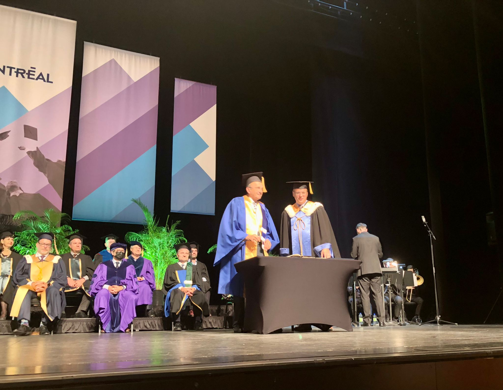

En automne 2022, Yves Pigneur, un ancien de la faculté (à l'époque, encore institut) d'Informatique a reçu plusieurs distinctions avec un Doctorat honoris causa de l’Université/HEC Montréal en septembre, un Doctorat honoris causa de l’Université de Neuchâtel en novembre et l’*Impact Award* de l’Association for Information Systems (AIS) avec Alex Osterwalder en décembre 2022.

