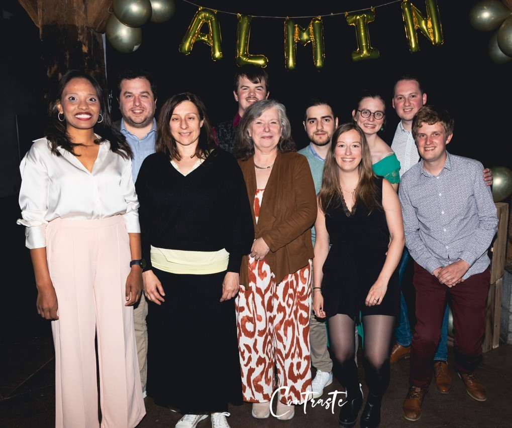
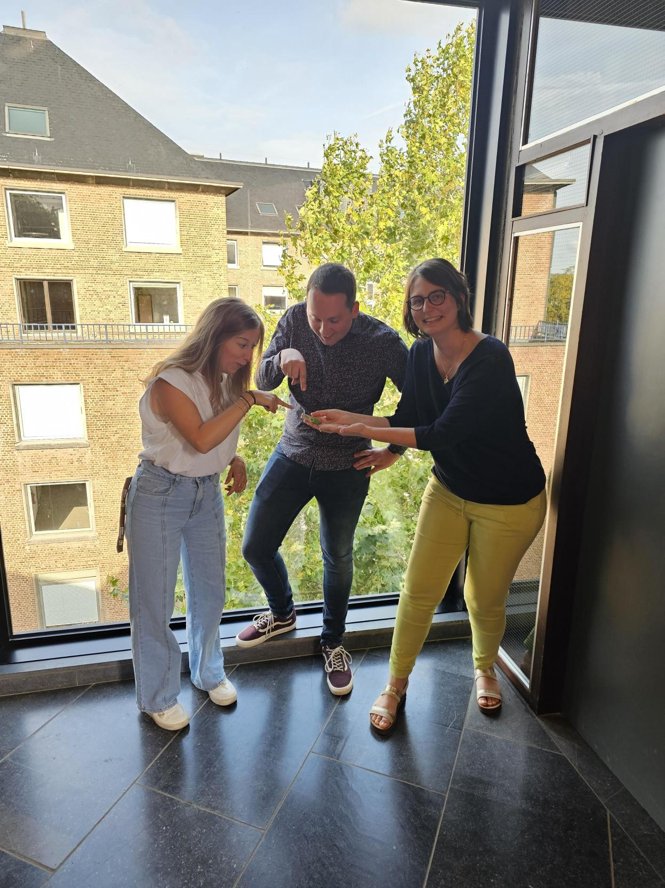

L'année précédente a marqué un grand retour pour l'ALMIN. Quatre événements ont offert aux anciens de la faculté l’opportunité de se réunir et d'échanger dans les ambiances variées de l'afterwork décontracté au Cercle ou encore de la soirée cinéma au Delta, en passant par celle de la conférence sur la cybersécurité. Enfin, l’année a pu se clôturer en beauté grâce au somptueux gala de l’ALMIN. Nous tenons à exprimer notre reconnaissance envers Babette, Catherine, Charline, Jérôme, Manel, Maxime, Pierre, Sacha, Sophie et Xavier pour leur précieuse contribution et leur bonne humeur sans quoi ces événements n'auraient pas été possibles.

Maintenant, tournons notre regard vers l'avenir ! Notre ambition pour l'année à venir est de maintenir le cap tout en continuant à innover. Notre objectif principal reste inchangé : dynamiser la communauté des anciens de notre faculté.

Pour amorcer cette nouvelle étape, nous avons le plaisir de vous convier à notre [premier afterwork spécial rentrée](/event/2023-10-19-afterwork/) qui se tiendra le 19 octobre à partir de 17h au Cercle Info. Au programme, la présentation de la nouvelle co-présidence ainsi que la révélation du calendrier complet de l'année à venir. Mais ce n'est pas tout ! Nous sommes également à la recherche de nouveaux membres pour rejoindre notre comité. Si vous êtes animés par l’envie de contribuer activement à l'ALMIN, cette rencontre constitue une opportunité idéale pour discuter de votre implication.

Nous avons hâte de vous retrouver et de partager cette nouvelle étape passionnante avec vous.

Charline et Maxime, vos nouveaux co-présidents
