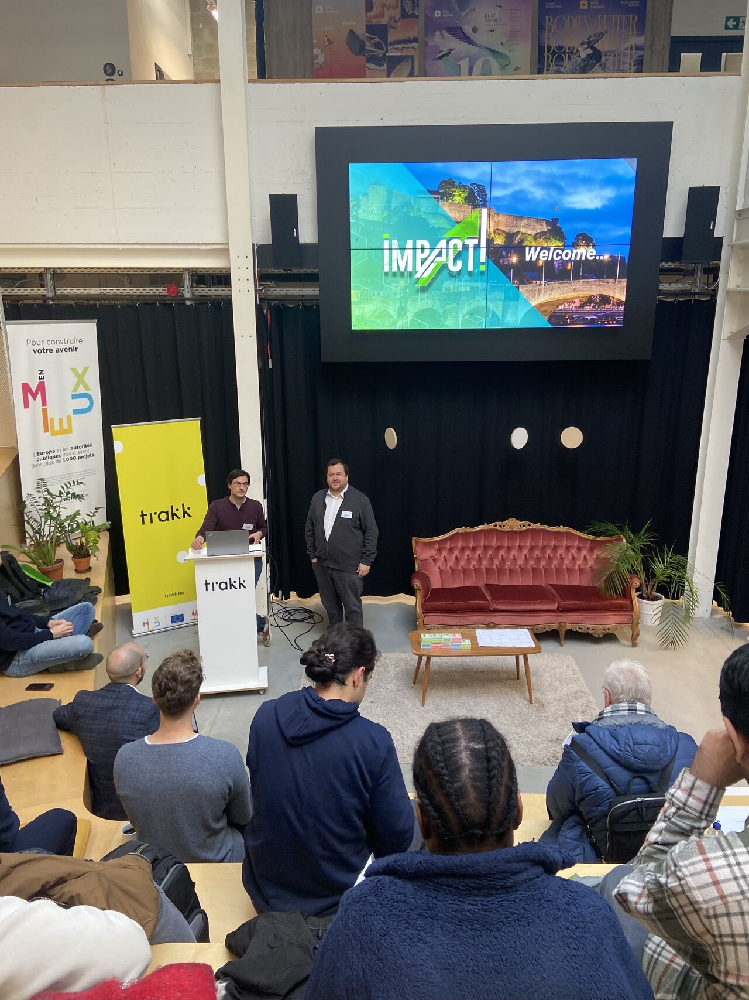

En mars 2024, l’initiative IMPACT! est lancée par la Faculté d’Informatique de l’Université de Namur en collaboration avec l’ALMIN. Elle a pour ambition de stimuler les dynamiques entre acteurs de l’entreprise, acteurs du monde académique et acteurs du monde politique dans la création de modèles d’affaires à impact. Ce n’est pas un hasard si cette initiative voit le jour dans cette faculté, qui a accueilli parmi ses étudiants Yves Pigneur, figure incontournable de la modélisation des modèles d’affaires.

À travers l’organisation d’événements et la création de contenu, l’initiative IMPACT! se développe. Son premier événement se tient le 15 mars 2024 sous la forme d’une conférence inaugurée par Yves Pigneur, suivi d’une table ronde d’experts réunissant aux côtés du conférencier, Annick Castiaux (professeure d’innovation à l’Université de Namur), David Dab (National Technology Officer chez Microsoft), Bérangère Fally (Innovation Manager chez Technocité) et Roald Sieberath (président de l’Agence du Numérique et investisseur).

Plus récemment, un IMPACT! Day a été organisé le 20 novembre 2024, à la veille de la conférence internationale BENEVOL, dédiée à l’évolution logicielle, qui s’est tenue les 21 et 22 novembre à l’Université de Namur. Lors de cette journée spéciale, des ateliers pratiques ont permis d’explorer l’application du Business Model Canvas à la recherche et la transformation de projets académiques en modèles d’affaires à impact.

Enfin, afin de clôturer cette année impactante, l’équipe d’IMPACT! et l’ALMIN ont eu l’opportunité d’interviewer Yves Pigneur pour discuter de sa vision future de l’innovation, prolongeant ainsi une première interview réalisée en 2021 sur son parcours.

## Yves Pigneur

Yves Pigneur, chercheur belge de renom, a obtenu son doctorat en informatique à l’Université de Namur avant de devenir professeur à l’Université de Lausanne, en Suisse. C’est là qu’il a collaboré avec Alexander Osterwalder pour inventer le Business Model Canvas, un outil adopté par des millions de professionnels à travers le monde pour repenser leurs modèles économiques. Ensemble, ils ont co-écrit plusieurs bestsellers, dont Business Model Generation, Value Proposition Design et, plus récemment, The Invincible Company. Ces contributions ont valu à Yves Pigneur une reconnaissance internationale, le classant parmi les dix penseurs les plus influents en management selon Thinkers50. Son travail a transformé la manière dont les entreprises conçoivent et adaptent leurs modèles d’affaires, faisant de lui une figure incontournable dans les domaines de la stratégie et de l’innovation.

### Bonjour Yves Pigneur et merci de nous accorder cette interview complémentaire à votre retentissante présence au premier événement IMPACT! du 15 mars 2024. Celui a réuni plus de 200 personnes. Avant de parler de l’avenir, revenons brièvement sur votre parcours. Vous avez commencé dans l’informatique avant de vous tourner vers le management. Comment s’est opérée cette transition et en quoi votre parcours en informatique a influencé votre approche des modèles d’affaires ?

Y.P. J’ai débuté par une thèse en modélisation des systèmes d’information à l’Université de Namur, en informatique, avant de poursuivre mes recherches en adaptant ces techniques à d’autres domaines. À la fin des années 90, sur le campus de l’École polytechnique fédérale de Lausanne, un véritable lieu d’échange d’idées, je rencontrais régulièrement des étudiants, des entrepreneurs, des scientifiques et des ingénieurs. Ils me demandaient souvent de vérifier leurs business plans. Mais à l’époque, les banques ne s’intéressaient qu’à ces plans financiers, sans vraiment chercher à comprendre le projet sous-jacent. Je posais alors des questions simples pour structurer leurs idées : Qui sont vos clients ? Quels problèmes résolvez-vous ? Quels canaux utilisez-vous ? Avec Alexander Osterwalder, nous avons transposé les approches de modélisation informatique pour créer une ontologie des modèles d’affaires, avant de développer un outil plus visuel : le Business Model Canvas. Pour moi, ce travail a été une continuité plutôt qu’un revirement. J’ai toujours cherché à modéliser et à simplifier des concepts complexes pour les rendre accessibles. Ici, il s’agissait de construire un langage visuel commun, clair et concret, qui permettait aux entrepreneurs de mieux communiquer leurs idées et de collaborer efficacement. Cet outil a ensuite évolué, devenant le cœur d’une boîte à outils complète dédiée à l’entrepreneuriat.

### Au début, les financiers étaient attachés aux business plans traditionnels. Comment avez-vous surmonté cette réticence à l’adoption du Business Model Canvas ?

Y.P. Effectivement, au début, il y avait des réticences, notamment du côté des financiers. Pendant longtemps, ils insistaient pour avoir des business plans, ce qui nous a amenés à préciser, dans le premier livre, comment passer progressivement d’un Business Model Canvas à un business plan. Nous étions conscients qu’il fallait garder une certaine souplesse et ne pas éliminer l'outil traditionnel. Cela dit, au fil du temps, l’acceptation du Business Model Canvas a progressé. Une enquête récente a montré que 88% des incubateurs et accélérateurs dans le monde utilisent désormais cet outil. En pratique, de plus en plus d’acteurs combinent les deux outils. Le langage du Business Model Canvas s’est donc imposé et est désormais largement adopté.

### Qu’est-ce qui, selon vous, a contribué au succès du Business Model Canvas (BMC) ?

Y.P. Je pense que plusieurs facteurs ont joué un rôle. Tout d’abord, sa simplicité a été un élément clé. Ensuite, avec Alex Osterwalder, nous avons créé un véritable mouvement autour du Business Model Canvas, notamment à travers le livre Business Model Generation. Cela a attiré des passionnés qui ont contribué au bouche-à-oreille et ont rejoint la communauté. Un autre facteur important a été de rendre le Business Model Canvas disponible en open source, sous une licence Creative Commons. Cela a permis à chacun de l'adopter et de l’adapter à ses besoins. Enfin, je dirais qu’un facteur de succès reste la chance, car à ce moment-là, il manquait effectivement un outil aussi simple et accessible pour les entrepreneurs.

### Quels conseils donneriez-vous aux entrepreneurs qui souhaitent intégrer l’interdisciplinarité dans leurs projets ?

Y.P. J’ai davantage des souhaits que des conseils. J’aimerais que les entrepreneurs ne renoncent pas à leurs rêves, à leurs passions, même en cas d’échec. Il est essentiel de garder la flamme vivante, car je suis convaincu que ces jeunes peuvent changer ce qui semble impossible. L’interdisciplinarité est un outil précieux pour atteindre ces rêves. La diversité des compétences et des perspectives est un véritable moteur de progrès. Si l’on constitue des équipes avec des profils variés, venant de différentes disciplines, on avance plus rapidement vers la réalisation des objectifs fixés. L’entrepreneur ne doit pas se limiter à une seule spécialité, car cela peut limiter son potentiel. L’interdisciplinarité permet de couvrir des domaines où l’on manque parfois de compétences, et elle doit être vue comme un moyen d’enrichir son projet et de concrétiser ses ambitions.

### Vous en êtes la preuve, l’innovation ne concerne pas que le résultat mais elle concerne aussi ses méthodes. Dans un monde qui change, comment rendre les objectifs du développement durable centraux dans les modèles d'affaires ?

Y.P. Il y a trois grandes situations pour intégrer le développement durable dans les modèles d'affaires. La première, c’est quand une start-up met dès le départ un impact sociétal ou environnemental au cœur de son modèle. C’est assez simple. La deuxième, c’est pour une entreprise existante qui, jusqu'à présent, n'a pas pris en compte ces enjeux, mais qui veut se transformer. Là, c’est plus compliqué. Enfin, la troisième situation, c’est celle des grandes entreprises ou grands groupes d’entreprises qui ont un portefeuille de plusieurs modèles d'affaires différents. Elles doivent intégrer des objectifs durables dans chacun de ces modèles, ce qui peut être difficile. Pour réussir, il faut être très clair sur les objectifs que l'on se fixe, comme la réduction du CO2. Il est important d’avoir des métriques pour mesurer ces impacts, et de définir des objectifs concrets. Nous pensons qu’il faut aussi développer des outils spécifiques, comme des "design patterns", pour guider les entreprises dans cette transition. Ces outils devraient leur permettre d'intégrer des impacts environnementaux et sociétaux dans leurs projets de manière pratique et mesurable.

### Les profils d’entrepreneurs sont-ils négligés dans les cursus scolaires ?

Y.P. Il y a 20 ans, à HEC Lausanne, il n'y avait pas de cours d'entrepreneuriat, mais aujourd'hui, beaucoup d'écoles ont développé des formations, des incubateurs et des programmes d'accompagnement pour les jeunes entrepreneurs. Ce soutien prend des formes variées, allant des cours structurés aux programmes d'accélération intensifs. L'objectif est d'accompagner les étudiants dès le début, de la phase d'idéation à la mise en œuvre, en leur fournissant les outils nécessaires. Des pays comme le Canada ou Israël montrent que l'on peut toujours améliorer ces systèmes. L'important est que les établissements offrent une initiation à l’entrepreneuriat et qu'elles soient capables d'accompagner concrètement ceux qui souhaitent aller plus loin avec leur idée, avec un accompagnement progressif, au-delà des cours traditionnels.

### Si vous aviez une baguette magique pour créer une formation innovante parfaite, comment la concevriez-vous ?

Y.P. Si j'avais la possibilité de créer une formation idéale, elle prendrait la forme d’un programme qui intégrerait des étudiants de disciplines variées afin de favoriser l'interdisciplinarité et la complémentarité. Ils seraient directement en situations réelles, immergés dans un projet de création d'entreprise ou d'innovation. Les formateurs seraient des entrepreneurs passionnés, et non de simples gestionnaires recyclés. Enfin, la formation devrait être évolutive, s'adaptant aux évolutions rapides du monde entrepreneurial, notamment avec l'intégration de nouvelles technologies. L'objectif serait que cette formation soit flexible et capable de se remettre en question en fonction des besoins des étudiants et de l'évolution du marché.

### Comment envisagez-vous l'avenir de l'innovation ?

Y.P. Le futur de l'innovation est un véritable défi. Actuellement, il y a une régression dans l'application de l'innovation au sein des entreprises, malgré le fait que 83% des dirigeants la considèrent comme une priorité. Une étude récente montre que seulement 3% des entreprises mettent réellement l'innovation en pratique, contre 20% il y a deux ans. Cette régression peut s'expliquer par plusieurs raisons. Par exemple, la réduction des budgets d'innovation et la crise du COVID, qui ont mis sous pression les entreprises et modifié leurs priorités. Pour y remédier, il est essentiel d'adapter les formations, en enseignant des pratiques modernes d'innovation, telles que le prototypage, les tests et la réduction des risques, tout en intégrant une culture qui accepte l'échec constructif. L'innovation ne doit pas être perçue comme un simple projet à gérer comme les autres, mais comme un processus exploratoire, où l'on doit apprendre à gérer les incertitudes et à tester des idées sans garanties de succès immédiat.

### Bonus : Plutôt chocolat suisse ou chocolat belge ? 😉 🍫

Y.P. Ah ! (rire) C’est une question que l’on me pose souvent quand on sait que j’ai la double nationalité. Je suis belge d’origine, mais pour moi, quand on aime le chocolat, on aime les deux !

## Actualité d’Yves Pigneur

- Novembre 2022, doctorat honoris causa de l’Université de Neuchâtel.
- Décembre 2022, “Impact Award” de l’Association of Information Systems (AIS).
- Novembre 2023, classés à nouveau avec Alex Osterwalder dans le top 10 de Thinkers50.
- Juin 2024, le livre BMGEN classé dans les 10 livres classiques du management 2024 par Thinkers50.

Une interview signée Maxime ANDRÉ, co-président ALMIN 2023-2024.
